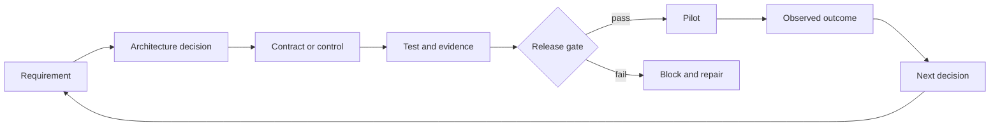

# Architect Professional 系统综合项目

> 构建一份以证据支撑生产架构、使其经得起审查的证据包。

**类型：** 构建
**语言：** Python
**前置要求：** 本路线第 1–28 课：产品选择、需求契约、上下文、验证、治理、Messages API、结构化输出、工具、MCP、Agent SDK、安全、评估、Claude Code、编排、集成、可观测性与生命周期。
**预计时间：** 约 8 至 12 小时

## 学习目标

- 为生产 Claude 系统交付从发现到运维的架构。
- 论证模式、模型、上下文、RAG、集成与控制决策。
- 用明确门禁证明质量、延迟、成本、安全和安保。
- 打包治理、发布、运行手册和生命周期所有权。
- 向管理层、工程、控制和运维受众陈述同一决策。

## 任务

为跨区域运营的公司设计受治理的企业支持解决系统。当前团队每周处理 40,000 张工单，账单和配送问题占大多数；首响中位数为 11 分钟。政策每周在文档和内部系统中变化，审核发现引用不一致，之前的自动化曾在员工权限之外退款。

系统可以分类工单、检索现行政策、读取有边界的账户上下文、起草回复并建议操作；不得删除账户。退款执行需要明确权限和新鲜的人工批准。公司需要分阶段发布、可测量质量、按区域处理数据，并向支持平台团队完成运维移交。

目标不是最大化自主性，而是在约束下设计最好的系统，并证明其已就绪。

## 必需交付物

使用 `outputs/architecture-packet-template.md` 模板。包必须包含十项相连产物：

### 1. 发现简报

定义结果、基线、目标、护栏、用户、当前工作流、数据、权限、假设和非目标。至少区分首响与总解决时间、系统完成与政策正确成功、建议与执行权限、内部目标与合同承诺、已知事实与估计。

### 2. 架构方案与 ADR

至少比较：检索辅助起草加完整人工审核、带有边界模型步骤的确定性工作流、自适应工具 agent。选择一项，记录证据、后果、被否决备选和逆转条件。若使用多个 agent，论证每个上下文边界或独立审核人；组件更多不代表得分更高。

### 3. 端到端系统视图

为系统上下文、数据与身份流、普通工单、高风险退款、部署与所有权、故障与部分结果路径创建 Mermaid 图。每条外部边都必须说明 schema、身份、超时、重试、证据和负责人。

### 4. 模型、Prompt 与上下文计划

为每类任务定义模型选择标准，包括质量、延迟、成本、上下文和思考需求；不要在没有验证日期时固化产品事实。设计系统和用户指令边界、需要一致判断时的 few-shot、稳定前缀与 prompt 缓存、上下文裁剪和压缩、结构化输出和语义验证、prompt 与模型版本管理。

### 5. 知识与 RAG 设计

指定来源所有权、解析、chunk 形态、元数据、稀疏或稠密检索、过滤、重排、上下文组装、来源、冲突、新鲜度、版本激活和回滚。以正常、模糊、过期、未授权和对抗案例评估检索，并将检索与回答质量分开测量。

### 6. 集成与身份设计

从需求选择直接 API、CLI、MCP 或 agent-to-agent 边界。跨工具发现、schema、凭证和操作使用最小权限。退款批准必须绑定主体、金额、账户、原因、过期时间和单次使用；为校验、授权、冲突、限流、依赖和超时定义结构化错误。

### 7. 评估与生产证据

建立代表性 golden set 和混合评估计划，覆盖检索召回与新鲜度、主张支持与引用覆盖、策略遵守、工具和授权轨迹、不安全操作防止、P50/P95 延迟、每项被接受任务成本、审核人一致性和时间、高风险及区域/语言切片。比较基线与方案，并定义不能被平均分抵消的硬门禁。

### 8. 治理与人工审核

产出风险登记册、数据图、控制矩阵、审核设计、公平性计划、可争议路径、事故证据计划和重大变更触发条件。明确哪些问题需要安全、隐私、法律、合规、财务或领域批准；不要替这些负责人声称法律合规。

### 9. 发布与运维

规划影子、金丝雀、受控扩展、回滚、仪表盘、告警、运行手册、容量、依赖故障和审核队列行为。每项告警必须有负责人和操作，每个生产版本必须有已知安全回滚。针对过期政策、授权故障、工单 prompt 注入和评估器漂移进行桌面演练。

### 10. 利益相关方与移交包

准备一页管理层决策简报、产品工作流和采用计划、工程契约索引、安全和隐私控制摘要、运维就绪和移交清单。接收团队必须在接受前演示监控、安全关闭、回滚、评估和事故升级。

## 架构方法



全包使用一条证据链：组件若不能追溯到需求，就应质疑其必要性；需求若没有控制或测试，架构就不完整；测试若没有发布后果，就只是报告。

## 动手构建

## 交互实验

```figure
32-architect-professional-readiness
```

使用专业就绪看板连接需求、决策、控制、证据、发布门禁、试点结果和生命周期负责人。无论加权就绪分数如何，硬授权、安全和回滚故障都必须可见。

## 实践实验

让支持架构经历一次失败需求、未验证硬控制、失败评估门禁和回滚演练，并在各自负责人边界修复。

## 交付产物

模板、完成的 [`outputs/reference-architecture-packet.md`](../outputs/reference-architecture-packet.md)、填写完成的 [`outputs/demo-readiness-report.json`](../outputs/demo-readiness-report.json) 和 [`outputs/scored-rubric.md`](../outputs/scored-rubric.md) 是实用产物。参考评分在其命名的 live 硬门禁和移交证据通过前，仍被阻止生产发布。

## 验证

Python 实验验证架构包结构，不判断业务决策是否正确。它捕获缺失负责人、不可测量需求、未验证硬控制、失败评估门禁、缺少回滚和没有逆转规则的决策。

```bash
cd certifications/claude/lessons/32-architect-professional-system-capstone/code
python3 main.py
python3 -m unittest discover tests -v
```

### 第 1 步：编码需求

每个 `Requirement` 有类别、可测试陈述、可测量标志和负责人；在你的包中用明确测量契约替代该标志。

### 第 2 步：编码决策

每个 `Decision` 记录背景、选择、被否决方案、后果、逆转条件和负责人。没有备选的建议无法展示权衡判断。

### 第 3 步：编码控制

每个 `Control` 命名风险、类别、负责人、证据、验证状态和是否为硬发布门禁。失败硬门禁会阻止发布，不受平均就绪度影响。

### 第 4 步：评估门禁

`EvaluationGate` 支持最小、最大和相等阈值，用于质量、延迟、成本和零容忍控制结果。真实门禁还需置信区间、样本要求和分段覆盖。

### 第 5 步：作出发布决策

`release_decision` 返回所有发现和阻塞数量。玩具实现报告非目标遗漏但不阻塞；你的审核委员会可以把它设为门禁。复现报告并运行全部确定性门禁；六道题测验检查个人架构判断。

## 综合项目关联

完成的十产物包、答辩、演练和被接受的移交构成 Architect Professional 综合项目提交物。

## 架构答辩

在 20 分钟内展示该包，并以产物和证据回答：为何该模式比最强的被否决备选简单？每个模型和 agent 调用由哪个需求证明？检索不足或冲突时怎么办？哪个身份到达每项工具、权限如何检查？什么证据阻止发布？如何证明较便宜方案按成功结果计也更便宜？审核人能看到、决定和升级什么？部署前哪些产品细节需重新核验？谁拥有每个来源、控制、指标、告警和事故？什么证据会让你逆转架构决策？“模型有能力”不是答辩。

## 评分规则

| 领域 | 权重 | 掌握证据 |
|---|---:|---|
| 解决方案设计 | 17 | 方案符合需求；分解和反馈明确 |
| 模型、prompt、上下文 | 13 | 选择和复用遵循测量的权衡 |
| 集成 | 19 | RAG、协议、身份和最小权限一致 |
| 评估与优化 | 16 | 代表性测试与运维信号驱动发布 |
| 治理与风险 | 14 | 数据、控制、审核、公平和批准有负责人 |
| 利益相关方生命周期 | 14 | 决策转化为交付、采用、移交和变更 |
| 开发者运维 | 7 | 团队配置、调试、运行手册和所有权可用 |

规则用于自审和独立审核，是课程工具，不是官方考试评分模型。

## 考试决策模式

Professional 考试奖励生命周期判断：当多个方案都合理时，选择能在正确系统边界解决陈述约束、并产生可供另一负责人验证的证据的方案。

- 自动化前先澄清。
- 防护前先最小化。
- 生成前先检索和过滤。
- 在执行时授权。
- 验证语义主张，不只验证语法。
- 评估完整轨迹和最终状态。
- 遇到硬控制即阻塞。
- 渐进式发布。
- 在变更和退役中指定负责人。

## 常见综合项目故障

### 没有决策的精美图

补充需求、备选、后果和逆转条件。

### 没有证据的长控制清单

为每个控制指定负责人、测试、结果、失败响应和审核触发条件。

### 只含理想路径的评估

增加模糊、过期数据、冲突来源、prompt 注入、授权故障、工具超时、高风险切片和审核人超载。

### 没有容量的人工审核队列

估计量、时间、资质、SLO、回退和升级。

### 没有恢复证明的移交

运行演练。运维团队应能在架构师不逐步讲解的情况下恢复已知安全状态。

## 练习

1. 用受监管的文档分析工作流替换支持场景，识别变化的控制和负责人。
2. 向 `EvaluationGate` 添加统计置信度和最小样本量。
3. 在机器可读包中将授权和过期来源控制设为硬门禁。
4. 让独立审核人找出五个没有测试或负责人的需求。
5. 在模拟金丝雀回归后记录一次真实的逆转决策。

## 关键术语

| 术语 | 人们的说法 | 实际含义 |
|---|---|---|
| 架构包 | 很长的设计文档 | 相连的决策、契约、证据、控制、所有权和恢复 |
| 硬门禁 | 高权重指标 | 无论平均数如何都阻止发布的条件 |
| 就绪 | 代码完成 | 已证明满足需求并能安全运维故障 |
| 架构答辩 | 演示技巧 | 以证据支持的选择、后果和被否决方案说明 |
| 运维负责人 | 部署团队 | 对 SLO、事故、变更和退役负责的角色 |

## 延伸阅读

- [Claude Certified Architect Professional 考试指南](https://everpath-course-content.s3-accelerate.amazonaws.com/instructor%2F6nizmqk8tpzpfjvt6qmmav7rh%2Fpublic%2F1783542810%2FClaude+Certified+Architect+%E2%80%93+Professional+Exam+Guide.pdf)
- [Claude Platform 文档](https://platform.claude.com/docs/en/home)
- [构建高效的 agent](https://www.anthropic.com/research/building-effective-agents)
- Architect Professional 路线的每一课
